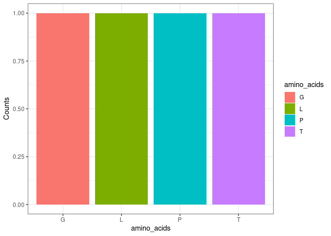

<!-- README.md is generated from README.Rmd. Please edit that file -->

# DOgma

**Group 5: Astrid (s184248), Caroline (s183493), Christian (s165476),
Frederik (s184260) and Nils (s220672)**

``` r
devtools::load_all()
#> ℹ Loading DOgma
library(DOgma)
```

Dogma is an R package meant to mimic the molecular dogma of biology.
Thus, DOgma can be used to translate DNA to RNA and then translate the
RNA sequence to a protein sequence by using the 64 different codons of
the genetic code. The package has multiple use cases, one of which is
analysing the abundances of amino acids in protein sequences. However,
the package can also be used only to translate DNA sequences to protein
sequences. The package contains 5 different functions:
“DNA_generator”,“DNA_to_RNA”, “sequence_to_codons”,“export_codons” and
“AA_abundance”. The first function “DNA_generator” can be used to
generate a random DNA sequence of a specified length.

``` r
DNA_seq <- DNA_generator(12)
DNA_seq
#> [1] "TTACCTGGGACC"
```

The next function “DNA_to_RNA” translates the DNA sequence into an RNA
sequence.

``` r
RNA_seq <- DNA_to_RNA(DNA_seq)
RNA_seq
#> [1] "UUACCUGGGACC"
```

The RNA codons can then be generated from the RNA sequence by using the
function sequence_to_codons.

``` r
codons <- sequence_to_codons(RNA_seq)
codons
#> [1] "UUA" "CCU" "GGG" "ACC"
```

These generated codons can then be used to translate the RNA sequence
into a protein sequence by using the function “export_amino_acid”.

``` r
prot_seq <- export_amino_acid(codons)
prot_seq
#> [1] "LPGT"
```

The abundance of each amino acid in the genreated protien sequence can
then be analysed and graphed using the function AA_abundance.

``` r
aa_abundance_graph <- AA_abundance(prot_seq)
aa_abundance_graph
```


